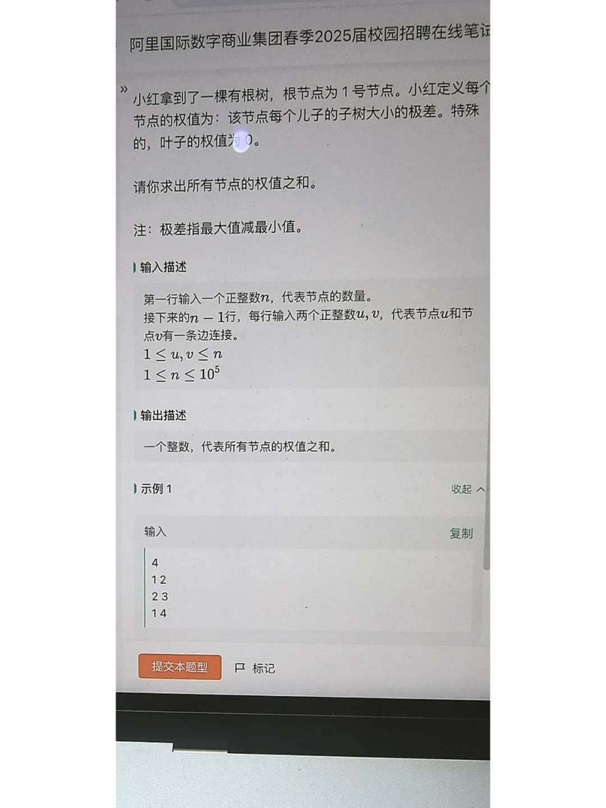
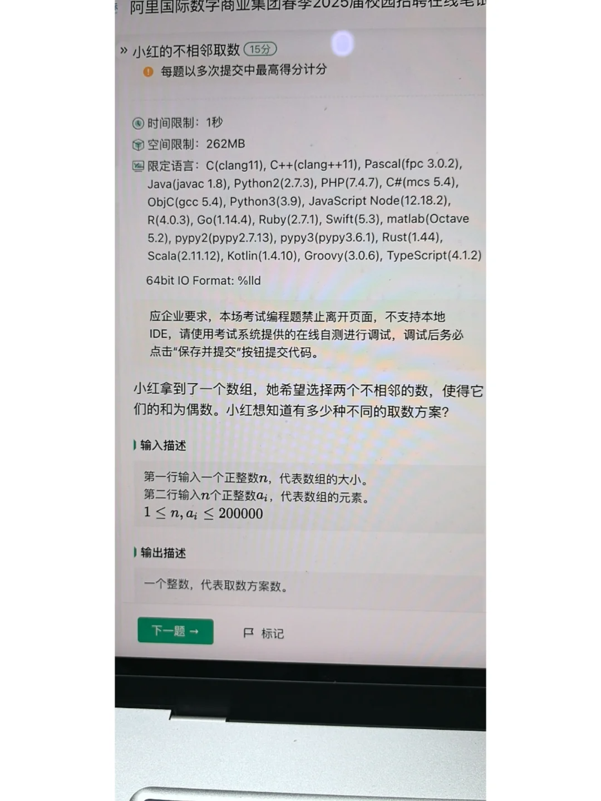

### 1


树形dfs，通过树形dfs得到每个子树的大小cnt[i]，以及每个节点的儿子g[i]，遍历更新答案。
```Python
n = int(input())
adj = [[] for _ in range(n)] # 相连接的
for i in range(n-1): # 接下来n-1行
    u,v = list(map(int,input().split()))
    u -= 1
    v -= 1
    adj[u].append(v)
    adj[v].append(u)
cnt = [1]*n
g = [[] for _ in range(n)] # 子树
def dfs(u,p):
    global cnt,g
    for v in adj[u]:
        if v != p:
            dfs(v,u)
            cnt[u] += cnt[v]
            g[u].append(v)
dfs(0,-1) # 当前节点，parent
ans = 0
for i in range(n): # 遍历n个节点
    b = []
    for j in g[i]:
        b.append(cnt[j])
    b.sort()
    print(b)
    if b:
        ans += b[-1] - b[0] # 权值为子树极差
print(ans)


```

1. 先求出所有的i,j使得a[i]+a[j]为偶数，减去n（i=j的情况），除以2，即得到选两个数和为偶数的数量，再减去相邻的数和为偶数的数量，即为答案。