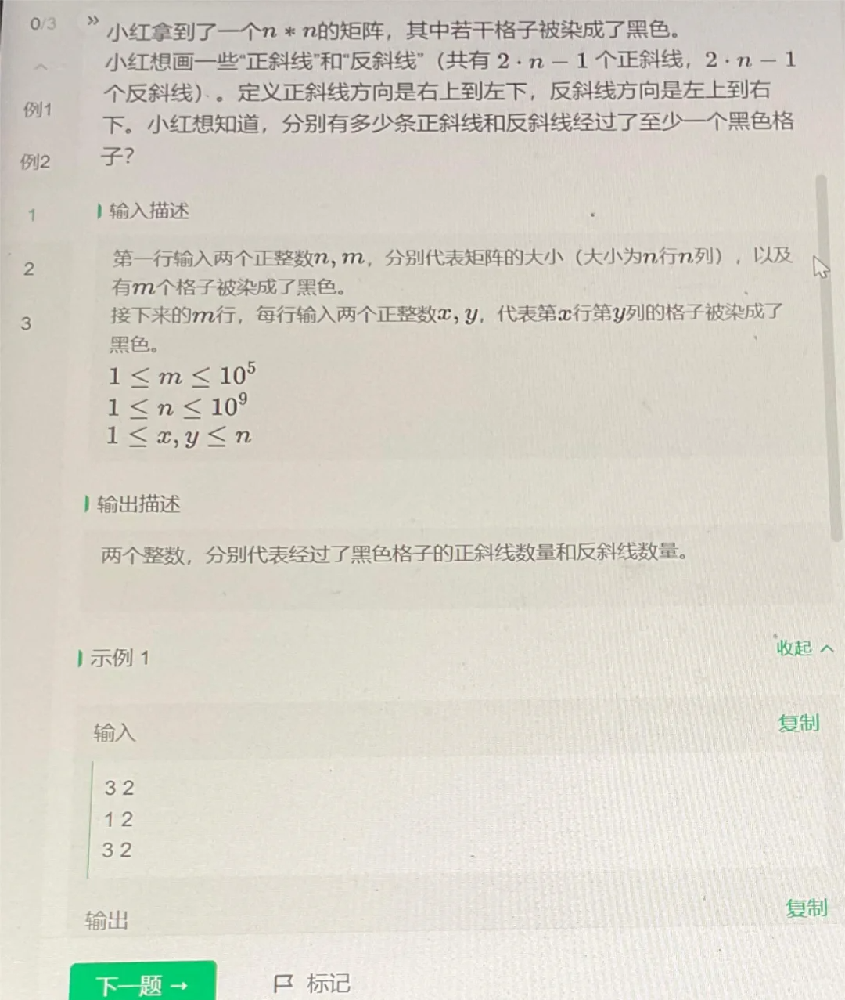
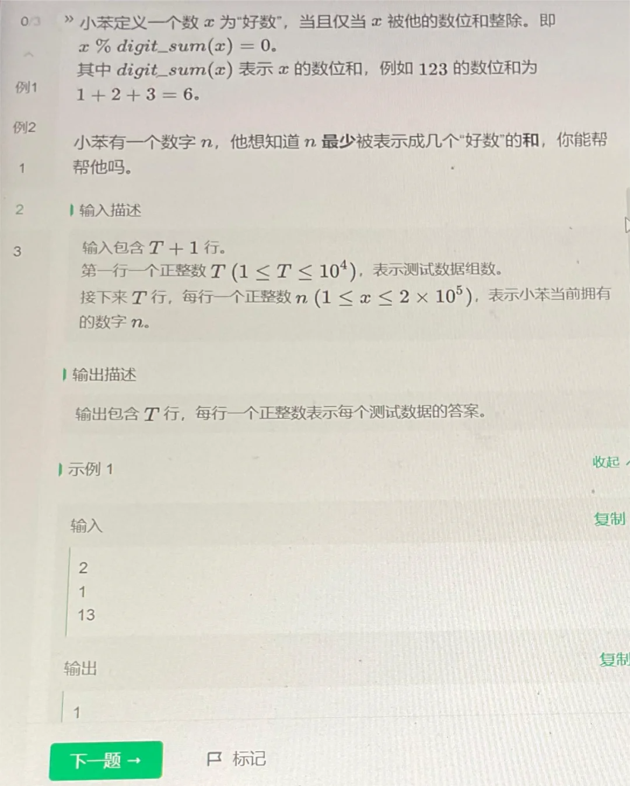
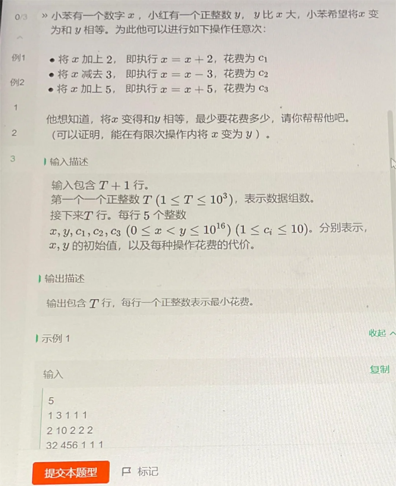
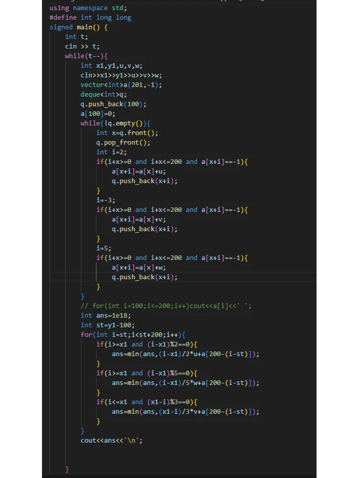

1. 对角线上和要么x+y相等，要么x-y相等，用两个set维护即可。
2. 输入一个点，可以判断属于一条正斜线和一条反斜线，将正斜线和反斜线都加入到set当中去重即可。
```Python
n,m = list(map(int,input().split()))
grid = [[0]*n for i in range(n)]
set1 = set()
set2 = set()
for i in range(m):
    x,y = list(map(int,input().split()))
    s1.add(x+y)
    s2.add(x-y)
print(len(set1),len(set2))
```

1. 结论题。打表可得答案要么是1，要么是2。将1-200000中的好数放到一个集合，查询即可。
2. 所有非好数可两好数相加得到.
```Python
n = int(input())
a = set()
N = 200010
for i in range(N):
    x = i
    z = 0
    while (x):
        z += x % 10
        x /= 10
    if (i % z == 0):
        a.add(i)
for i in range(n):
    if i in a:
        print(1)
    else:
        print(2)
```


解法：bfs。先考虑小范围[-100，100]区间的最小花费。然后枚举i从[y-100,y+100],若>=x，用2或5先到i，若<=x，用-3先到i，再加上预处理好的小范围[-100，100]区间的最小花费，取min即可。
