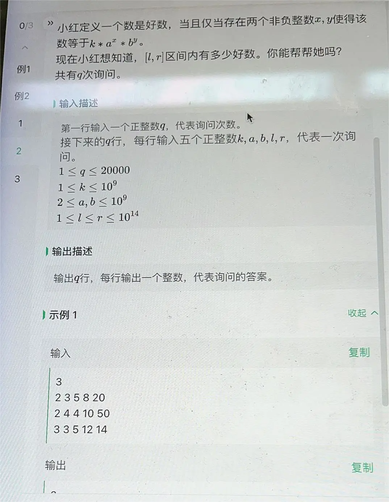

1. 暴力check。由于a，b>=2，于是a的幂和b的幂都是log量级的，分别遍历a的幂和b的幂从0到60，暴力check即可。
```Python
t = int(input())
k,a,b,l,r = list(map(int,input().split()))
cur = set()
x = k
for i in range(60):
    y = 1
    for j in range(60):
        if x*y >= l and x*y <= r:
            cur.add(x*y)
            y*=b
            if x*y > r:
                break
    x *= a
    if x > r:
        break
print(len(cur))
```


1. 子序列，可以不相邻，长度为3的子序列数量, 所有回文串 26*26(第一个数和第二个数，因为第三个数和第一个数相同)，剩下的数26**(n-3)
```Python
mod = 10**9 + 7
n = int(input())
num = n*(n-1)*(n-2) // 6
print(num*pow(26,n-1,mod)%mod)
```
